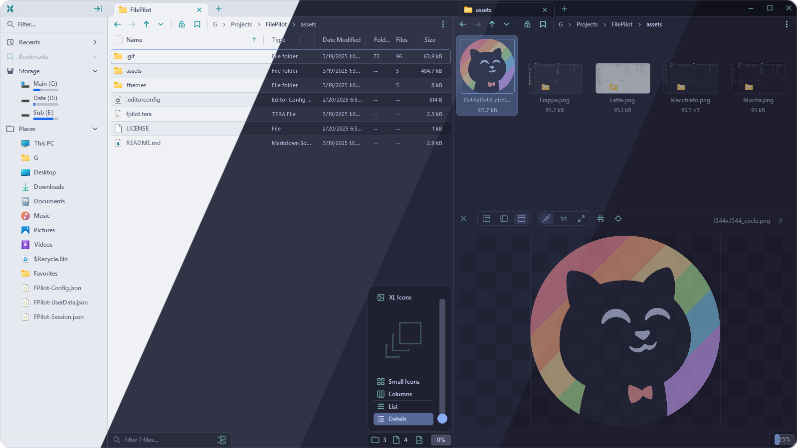
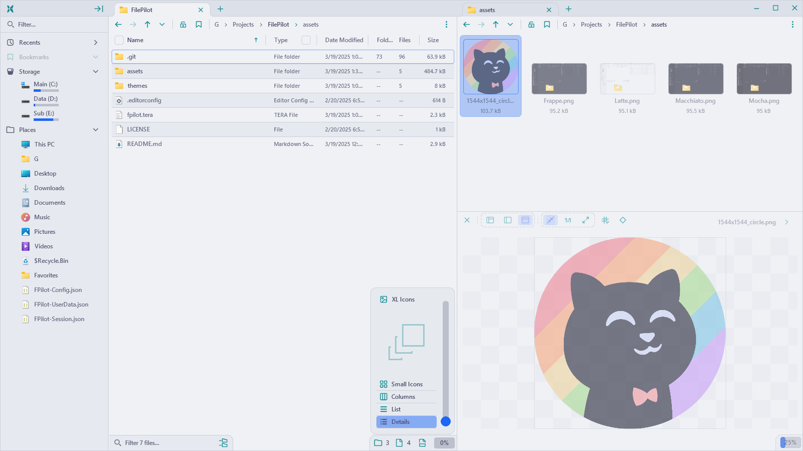
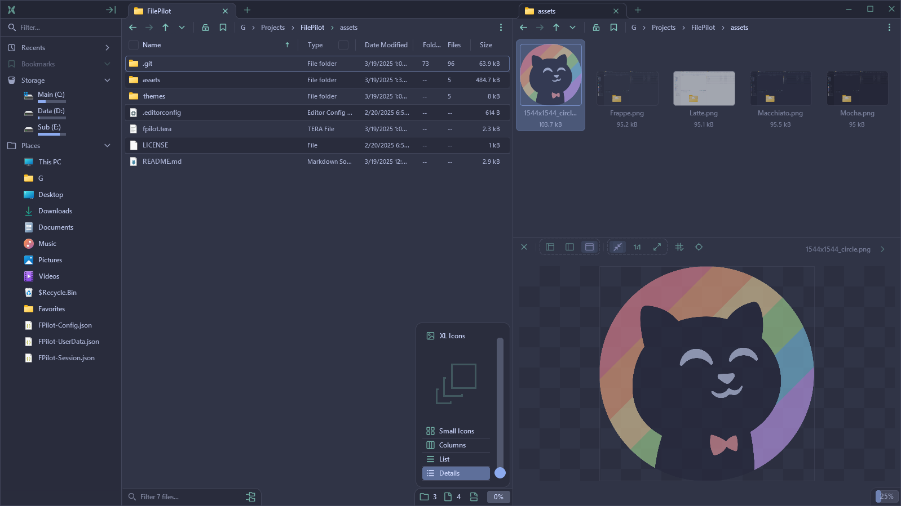
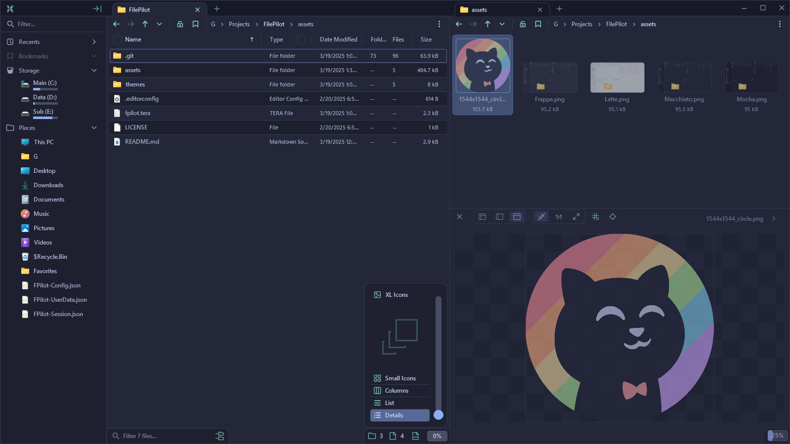
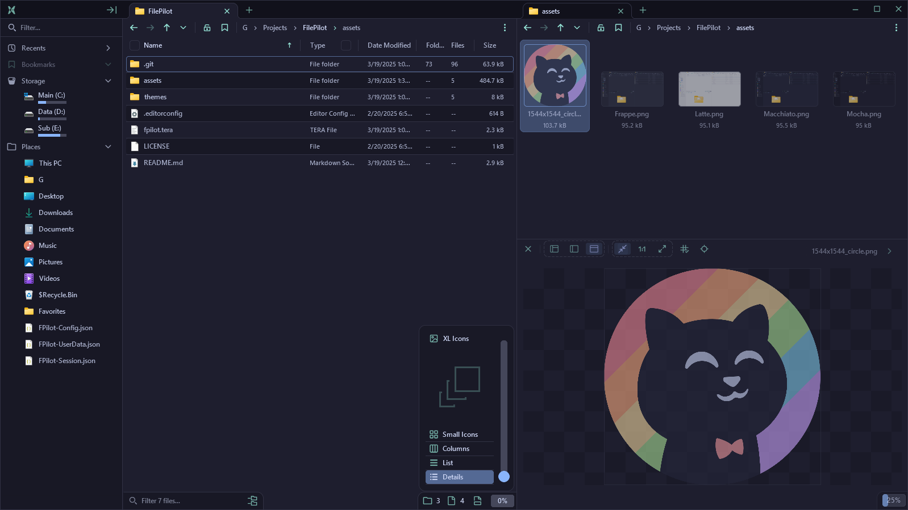

<h3 align="center">
	 
	
	Catppuccin for <a href="https://filepilot.tech/">File Pilot</a>
	
</h3>

	
	
	

	

## Previews

🌻 Latte

🪴 Frappé

🌺 Macchiato

🌿 Mocha

## Usage

> The software is still early in development. Expect upcoming changes.
1. In the File Pilot "Quick Access" sidebar, locate and open the configuration file.
	- Under "Places" > FPilot-Config.json
2. In this repository, locate the wanted theme in the themes folder.
3. Copy its contents and paste them in the config file, inside the "Colors":[] codeblock.
	- If it does not yet exist, it can be generated by forking a theme in the settings menu.

## 💝 Thanks to

- [gawidev](https://github.com/gawidev/)

&nbsp;

	

	Copyright &copy; 2021-present <a href="https://github.com/catppuccin" target="_blank">Catppuccin Org</a>

	

